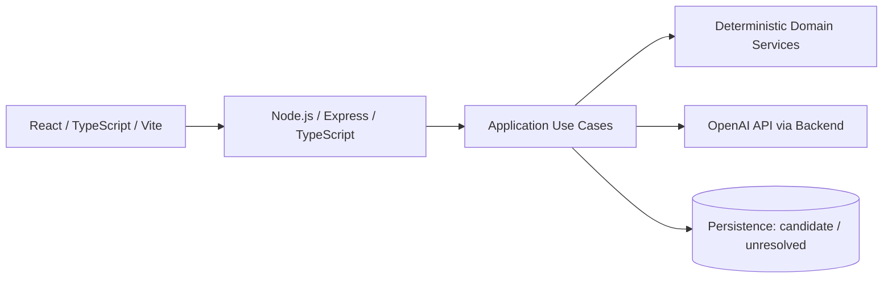

# Architecture

## Status

この文書はProduction Architectureの方針と現行実装を記録する。Frontend / Backend / sharedのFoundation、Onboarding、Adventure Map / Quest、Stage-wide Training Program生成とSession cache、Quest進行、Character Screen v1 / Hub Navigation、Production servingを実装済み。OpenAIはBackend経由でのみ呼び出す。D-034ではCurrent Questの日付変更をshared date-only DomainからReact Adventure Sessionへ接続する。Database、Authentication、Schedule永続化は未実装。

区分：

- **決定済み**: 採用方針。
- **有力方針**: 現時点で推奨するが、Decisionとしては未採用の方針。
- **候補**: 比較・検証対象。採用を前提にしない技術。
- **未決定**: Productまたは技術Decisionが必要。
- **Prototype確認**: `figma-reference/`にだけ存在する構成。

## Architecture Goals

1. ハッカソンMVPを小さなVertical Sliceで構築できる。
2. Quest完了、EXP、Map、Boss等の重要処理を再現可能にする。
3. AI SDK固有型をDomainから隔離する。交換可能なProvider境界の正式採用は有力方針として検討する。
4. API key、Persistence、ValidationをBrowserから分離する。
5. 将来のNutrition / MealAI再利用を可能にしつつ、現在のMVPを過剰設計しない。
6. Figma PrototypeのDummy LogicをProductionへ混入させない。

## Logical Architecture



この図はTrust boundaryを示す。Responses APIとStructured OutputsはTraining Plan Smoke Boundaryで採用済み。`AiProvider` / `OpenAIProvider`、`MockProvider`、Database製品はまだ固定しない。

### Trust boundary

- Browserは未信頼入力源として扱う。
- Express APIがAuthentication候補、Request Validation、Authorization、Rate Limit、Use Case起動の境界になる。
- OpenAI API keyとDatabase CredentialをBrowserへ送らない。
- AI出力も未信頼入力としてValidationする。

## Planned Stack

### 決定済み

- Frontend: React / TypeScript / ViteのWeb Clientを維持し、スマートフォンをPrimary ClientとするMobile-first UIを実装する。DesktopはSecondary accessとして扱う。
- Backend: Node.js / Express / TypeScript。以前共有されたProduct仕様で基本構成として明示されているため採用済みと扱う。
- AI: OpenAI APIをBackend経由で使用し、API keyをFrontendへ出さない。
- AI Integration Foundation: 公式OpenAI SDKを`server/`のみに置き、Responses API + Strict JSON Schema Structured Outputsを使用する。AI出力は`shared/`の`validateTrainingPlanDraft()`で再検証する。

### 有力方針

- AI boundary: `AiProvider` / `OpenAIProvider`をApplication層のPortとして採用し、OpenAI SDK固有型をDomainへ漏らさない

### 候補

- Web App拡張: PWA、Service Worker、Push Notification
- Native packaging: Capacitor
- 別Frontend技術への将来移行: React Native / Expo
- API Validation: Zod
- Styling: Tailwind CSS
- Database: Supabase PostgreSQL
- Authentication: Supabase Auth
- Development / Test: `MockProvider`

### 未決定

- PWA / Service Worker、Offline、Push Notification、Background syncの採用と運用
- Native packaging方法、App Store / Google Play配布、Native API利用
- HealthKit / Google Health Connect等のHealth data連携
- 最終Production Model（Development defaultは`gpt-5.6-luna`、`OPENAI_MODEL`で変更可）
- Production Prompt、Session Contextの取得・更新方法と将来拡張、Tool call採用、Retry / Timeout / Cost policy
- Deployment / Hosting構成

### Production delivery boundary

**実装済み**: Production buildは既存rootの`npm run build`で`shared`、`server`、`client`を順にcompileする。rootの`npm start`はcompiled Serverを起動し、Production modeで`client/dist`を同一Express originからstatic配信する。既存のrelative `/api/...` requestは同じoriginのAPI routeへ届くため、Production Backend URLのClient hardcodeやCORS緩和を必要としない。

- API routesを先に登録し、未知の`/api` / `/api/*`はJSON `404 { error: { code: 'NOT_FOUND' } }`として扱う。SPA fallbackはAPI pathへ適用しない。
- static assetは`client/dist`から配信し、非APIのGET / HEAD routeは`index.html`へfallbackする。
- `client/dist`はESM module locationから解決し、repository working directoryへ依存しない。開発時は従来どおりVite + proxyを使い、Express static servingを有効にしない。
- hostの`PORT`を優先し、未指定時は3000を使う。`OPENAI_API_KEY`はProduction hostのServer環境変数だけに置き、Client bundle、public error、logへ出さない。

**未決定**: Renderを含む具体的なHosting Provider、Deploy手順、monitoring、custom domain、環境変数運用は未決定であり、この実装は特定providerへのDeployを実行・採用するものではない。

有力方針と候補は導入前に`docs/DECISIONS.md`で正式採用を記録する。今回の採用範囲はD-021を参照する。

Mobile-firstはUI設計方針であり、Native App化を意味しない。現時点のProduction FrontendはWeb Clientで、PWAやCapacitorの設定は導入しない。

## Repository Layout

### 決定済み

npm workspacesを使用し、次の責務で分離する。

```text
client/           React / TypeScript / Vite
server/           Node.js / Express / TypeScript
shared/           Frontend / Backend共有型と決定論的Domain
docs/             Product / Architecture / Decision
figma-reference/  Figma Snapshot; Production対象外・Git管理外
```

`shared/`にはFrontend / Backendの両方から利用できる純粋なTypeScript Domainを置く。Prototype Dataや未確定のAPI contractは持ち込まない。

## Training Catalog Domain

### 決定済み

`shared/src/domain/training/`に、Equipment Master、Exercise Master、Gym Equipment Profile型、決定論的Filterを置く。

- EquipmentとExerciseを別Catalogとして管理し、安定したIDで参照する。
- ExerciseはPrimary / Secondary Muscle、Movement Pattern、Difficulty、必要Equipmentの選択肢、Alternative Exercise IDを持つ。
- Gym Equipment Profileは利用可能な`equipmentId`を保持する。UserやDatabaseへの保存方法はこのDomainへ含めない。
- Exercise FilterはPrimary Muscle、Movement Pattern、Difficulty、Gym Equipment Profileの指定された条件だけを適用する純粋関数とする。
- 必要Equipmentは、Exerciseに定義された完全なEquipment SetのいずれかをProfileが満たす場合だけ利用可能と判定する。
- Substitution候補は同じCatalogの明示的なAlternativeから、Muscle、Movement Pattern、利用可能Equipmentを決定論的に検証して返す。
- Training Candidate Builderは、Gym Equipment Profileと指定されたMuscle、Movement Pattern、Difficultyを既存Filterへ渡し、Plannerへ渡せるCatalog由来の候補だけを返す。
- Main Exercise指定時はCatalog所属とEquipment適合を検証し、正常なら他候補と別枠で保持する。不明なIDまたは実施不可能なMain Exerciseはcode付きErrorにする。
- Planner向け候補は`exerciseId`、表示名、Primary / Secondary Muscle、Movement Pattern、Difficultyに限定したDomain Dataであり、PromptやAI Provider契約ではない。
- Training Session Plannerは1回のSessionだけを扱い、Schedule / Roadmap層が決めるSession Focusと、事実値のTraining経験月数をCandidate Resultへ添える。週頻度やStrength Record / e1RM / Goalを直接受け取らない。
- MVPは主要Equipmentと代表Exerciseだけを収録し、Catalog Item追加で拡張する。全世界のExerciseやメーカー固有Machineは網羅しない。

Exercise情報の正式な情報源、監修、Catalog Versioningと更新運用、候補からの最終選択、件数、具体的なsets / reps推奨範囲、weightの決定は未決定。Draftのsets / rep range形状とCandidate再検証はD-020で決定済み。

## Frontend Responsibilities

Frontendが担当するもの：

- Screen / Navigation / Overlay表示
- Form inputとClient-side usability validation
- API request / responseの表示
- Loading、Error、Retry、Optimistic UIの制御
- AccessibilityとResponsive layout
- Serverから返されたGame State / View Modelの表示

D-038 Character ScreenとD-039 Progress ScreenはReact Adventure Session内の既存Roadmap、StageProgress、CharacterGrowth、Exercise Baseline、Workout Result、Exercise SuggestionをPresentation helperで読む。OnboardingのFinal Goalは既存Sessionへ引き継ぐ。共通helperがStage completed / total、Training / Recovery clear count、Boss remainingとMain Strength actual recordを導出する。画面表示用の派生値以外の新しいGrowth / Quest判定や永続化は持たず、Hub Navigationは既存のClient screen stateで切り替える。

Frontendが担当しないもの：

- e1RMの権威ある確定
- Quest完了判定
- EXP・Level・Boss・Stageの確定
- Schedule変更の正当性判定
- Databaseへの直接保存
- OpenAI API呼び出し
- API key管理

UI側で即時Preview計算を行う場合も、Server側で同じ決定論的ルールを再検証し、Server結果を正とする。

## Backend Layers

### HTTP / Transport

- Express route
- Request / Response schema validation。Validation libraryは未決定で、Zodは候補。
- Authentication / Authorization（採用時）
- Error mapping
- Idempotency keyまたは同等の多重実行防止

### Application Use Cases

候補となるUse Case：

- `CompleteOnboarding`
- `CreateRoadmap`
- `GetTodayQuest`
- `ToggleExerciseCompletion`または`RecordExerciseCompletion`
- `CompleteQuest`
- `SubstituteExercise`
- `RescheduleTraining`
- `RecordStrengthSet`
- `EvaluateBossEligibility`
- `DefeatBoss`
- `AdvanceStage`
- `GenerateTrainingPlanProposal`
- `GenerateMealProposal`

Application層はTransaction境界、Repository、Domain Service、AI integrationを調停する。Provider abstractionを採用する場合も、AI応答をそのまま保存・確定しない。

### Domain Services / Tools

Pure TypeScriptで決定論的に処理する。

- e1RM計算
- Quest完了条件
- EXP付与
- Level判定
- Map進行
- Date / Timezone計算
- Stage番号とBoss条件
- Schedule制約Validation
- Exercise Catalog FilterとEquipment適合判定
- Exercise substitution候補の決定論的絞り込み
- Reward確定ルール（採用時）
- Input / State transition validation

可能な限り副作用を持たない関数とし、入力、Rule Version、出力をテストできる形にする。

e1RMのMVP Domain API（D-023）は`shared/src/domain/training/e1rm.ts`に置く。Set計算、同一種目Workout内の最大値、基準日時を引数とするrolling 30×24時間の現在値、全期間PBを純粋関数で分離する。11回以上は正常記録だが推定対象外、不正な数値・日時はValidation Errorとする。内部値とBoss比較値を丸めず、UI表示丸め、保存、Boss state machine、Load / Progressionは含めない。Boss対象の4種目はCatalog実IDで明示し、汎用Set計算自体はExercise IDへ依存させない。結果はRule Versionと根拠Setを追跡できる計算用型であり、永続Schemaではない。過去の別Version値との混合・再計算方針は保存設計時に決める。

Workout ResultのMVP Domain API（D-024）は`shared/src/domain/training/workoutResult.ts`に置く。未知入力をCatalog ID、role、予定Set / rep range、Set番号、正の有限重量、正の整数rep、timestamp、未知Fieldで決定論的に検証する。これは保存Draftではなく、少なくとも1 Setを完了したExercise Resultを表す。予定Set数未達、rep range外、plannedExerciseIdとperformedExerciseIdの相違はRecordを不正にしない。後者はSubstitutionの正当性を再計算せず、実施Exercise側へD-023の既存`calculateWorkoutE1rm()`を接続する。Plan SnapshotとのID、role、sets、rep range照合は小さな純粋関数に分離し、Quest Clear、Load Prescription、Progression、API、Databaseは含めない。

Stage PlanningのMVP Domain API（D-025）は`shared/src/domain/training/stagePlanning.ts`に置く。`planNextStage()`は現在e1RMとFinal Goalから次のBoss Requirementだけを決定論的に返す。MVPの固定5kg stepとFinal Goal cap、baseline required、goal reached / goal update requiredを`stage-target-fixed-5kg-v1`で追跡する。Historical PB fallback、Final Goal変更、Roadmap Node、Boss state、Stage Clearはこの関数の責務外である。

同じshared境界で`validateAchievementDurationEstimatorInput()`がDuration Estimator専用Inputを厳格に検証し、`validateAchievementDurationEstimate()`がAIの`estimatedAchievementDays`のみを再検証する。Stage 2以降は`selectRoadmapDuration()`が`ROADMAP_DURATION_CANDIDATES`（14/21/28/35/42）からestimate以上の最小値を選ぶ既存ceiling ruleであり、42日超は`stage_replanning_required`を返す（`roadmap-duration-ceiling-v1`）。D-043 Stage 1は`stageOneQuickStart.ts`で初期D-025 targetを使って見積もり、28日超かつ+2.5kg / Final Goal capの縮小余地がある場合だけ一度再Estimateする。Stage 1候補はSharedの14/21/28だけで、縮小後も28日超ならtargetを保った28日Challenge Windowを返す。Schedule生成、曜日選択、Boss date、Boss Defeated、Quest / EXP / Mapは含めない。

Stage Roadmap ScheduleのMVP Domain API（D-026 / D-034）は`shared/src/domain/training/stageRoadmap.ts`に置く。`generateStageRoadmap()`はD-025で選択済みの候補Duration、厳格なローカル日付、週頻度`1..7`、Catalog上のMain Exercise、正のStage Targetから、`durationDays`件のTraining / Recovery Dayと当初の`startDate + durationDays`のBoss Anchorを副作用なく生成する。各7日blockのTraining offsetは`floor(i * 7 / frequency)`であり、Training focusはMain Exerciseの`primaryMuscles`のみとする。`rescheduleCurrentQuest()`は`currentDayIndex`のDaily Slotと以降の全SlotおよびBoss日を、明示されたBrowser local `today`と厳格なLocalDateに基づいて同じ正の日数だけ延期するpure functionである。Slot種別 / 順序 / Focus / Exposure、`startDate`、基本期間・Node数の`durationDays`、Target、進行Stateを変えず、完了済み過去Slotは不変とする。D-026の旧Training / Recovery swapはD-034によりProduction仕様から置き換えられた。

D-034ではServerのStage Program snapshot validatorも、各Dayの`startDate + dayIndex`からのdelay offsetが非負・単調非減少であること、Boss delayが最終Daily Slotのdelayと一致することを検証する。Node数、Type、D-032由来のFocus / Exposure、Main、Target、generation rule等は引き続きcanonical snapshotと一致させる。ClientのAdventureQuestContextは成功したRoadmapだけをatomicに差し替え、`StageProgress`、`planByDay`、Workout Results、Equipment、Stage Program contextは更新しない。永続化、AI再生成、Quest / EXP / Map progressionは含まない。

Quest Completion / Map ProgressionのMVP Domain API（D-027）は`shared/src/domain/training/stageProgress.ts`に置く。`StageRoadmap`を不変のScheduleとして保ち、`StageProgress = { currentDayIndex }`だけを進行Stateにする。`createInitialStageProgress()`、`deriveStageProgressView()`、`evaluateTrainingQuestCompletion()`、`completeTrainingQuest()`、`completeRecoveryQuest()`はすべてPure TypeScriptである。Map viewはcompleted / available / locked、現在Node、Session Focus、Boss Anchor、Boss availability、完了数を返すが、UI表現を持たない。

D-029の`shared/src/domain/training/onboardingRoadmap.ts`は、未知のOnboarding入力、Boss対象4種目、Baseline Set、Final Goal、D-026と共通の日付検証を扱う。自己申告BaselineはD-023のSet計算を再利用し、`onboarding_self_reported`の出所とRule Versionを持つ計算結果であってWorkout Historyの`currentE1rm`ではない。Pureな`prepareOnboardingRoadmap()`がStage 1の初期D-025 targetとDuration Estimator Inputまで、`completeOnboardingRoadmap()`がAI応答の再検証・Quick Start target / Duration選択・Roadmap・初期Progressまでを調停する。28日超で縮小Estimateが必要な場合は専用statusを返し、Client/Applicationが同一Onboarding submit内で既存Estimator endpointをもう一度だけ呼ぶ。Stage 1の初回Roadmapはknown / `estimated_profile`共通で最大28日となる。sharedからOpenAIを呼ばない。

D-043のNext Stage planningは`AdventureSession.stageNumber`をClientからSharedへ明示し、次に生成するStage番号に応じた候補をDomainで選ぶ。現行Next Stage flowはStage 2+なのでD-025のTargetと標準Duration / 42日超Error behaviorを維持する。表示ラベルや画面表示からStage numberを推定しない。

Clientの`application/onboardingRoadmap.ts`は開始操作時のBrowser local dateを入力へ加え、ExpressへDurationを一度要求する。`features/onboarding/`は3-Step UIのDraft StateとUsability validationを持つが、Baseline e1RMはsharedのD-023 APIから導出し、最終入力はこのApplication helperとshared Domainで再検証する。成功時は生成済みRoadmapと初期Progressだけを`AdventureQuestSession`へ渡してMapを表示し、Demo Bench Training Planを実ユーザーRoadmapへ結合しない。Equipment入力とStage Training Program取得は後続工程であり、Onboarding由来Training DayはProgram未生成の間「Training Planを準備中」と表示してClearを禁止する。Equipment確定後はD-031のStage-wide生成境界へ進み、成功したPlanを`planByDay`へ一括保存する。Recoveryは既存D-027 Domain境界で独立して扱える。

Training Clear評価は既存`validateExerciseWorkoutResult()`と`validateWorkoutResultAgainstPlan()`を再利用する。全main / accessory Plan itemにちょうど1件の有効でPlan整合したResultを要求し、planned / performedが異なるときだけ既存`getSubstitutionCandidates()`とEquipment Profileを用いる。Resultの登録やevaluationは進行させず、明示的completionだけがcurrent indexを一つ進める。RecoveryはChecklistなしの明示的completionである。日付、Schedule Change、e1RM、OpenAI、EXP、Boss State、Stage Clear、API、Database、Frontendはこの境界に含めない。

### Repository Ports

Application層はDatabase SDKを直接前提にせず、目的別のRepository interfaceを利用する。

例：

- `UserProfileRepository`
- `TrainingPlanRepository`
- `QuestRepository`
- `ProgressRepository`
- `CharacterRepository`
- `RewardRepository`

MVPでIn-memory実装を使うか、最初からDatabaseを使うかは未決定。

## Core Workflows

### Quest completion (D-027 / D-035 current boundary)

D-027では日別QuestのIdentityをRoadmap day indexとし、global Quest IDやAPI transactionはまだ導入しない。TrainingはWorkout Resultを評価して`readyToClear`を得た後、RecoveryはChecklistなしで、どちらも明示的Clear operationが成功したときだけ`currentDayIndex`を一つ進める。D-035ではその成功処理でProgress、Character Growth EXP、Reward Summaryを一つの純粋なDomain結果と一つのClient reducer transitionで確定する。再送された過去indexは`already_completed`となり、EXPとProgressを再適用しない。現段階ではSession内のみで、Level・永続化時のidempotency keyは未実装である。

D-035のShared DomainはCatalog Exercise IDからversion付きPrimary EXP Categoryを決定し、Plan整合・substitution検証済みのWorkout Resultにある`1..plannedSets`のSetだけをTraining EXP対象とする。Recovery QuestはWorkout ResultなしでRecovery EXPを付与する。Reward Summaryは適用済みの増分snapshotで、PresentationがResultから再計算しない。EXP単価やquest typeはDomainのversion付きRuleに集約し、UIへ埋め込まない。

D-035 4Eの`ExerciseProgressState`はExercise ID keyedのSession内Mapとして`AdventureQuestDomainState`に保持し、各Exerciseの初回Baseline（重量、reps、任意の未丸めe1RMとD-023 Rule Version、source、captured day index）と成功Clear済みSession数を分けて記録する。Onboarding Main BaselineはAdventure Session生成時に初期化し、自己申告または初回Workout ResultからのBaseline取得は同じExerciseの既存Baselineを上書きしない。Workout ResultのBaseline帰属先はvalidated `performedExerciseId`であり、D-023 `calculateWorkoutResultE1rm()`を再利用する。e1RM非適格Setしかない場合は最初の有効working setを保存し、e1RM値を持たない。

Baseline登録はResult保存・Quest Clear / EXPと独立する。Training Quest Clearが成功した場合だけ、同じ`completeAdventureQuest()`結果のDomain transitionで、Clearに含まれるunique `performedExerciseId`の`sessionsCompleted`を各1加算する。Recovery Clear、単なるResult保存、Baseline登録、rescheduleでは加算しない。Main Strength Baseline Panelを避ける判定にはOnboardingのBoss Main IDを使い、Session `role: 'main'`とは同一視しない。Persistence / localStorage / DBは追加しない。

D-036 Task 4Fでは、Sharedの`ExerciseWorkoutResult`が任意のExercise単位`difficultyFeedback`を保持し、既存のResult validatorが`too_hard` / `just_right` / `easy`のみを受け入れる。Workout Result formはSet入力とFeedbackを同じSubmitで送り、既存Resultの編集時はSet値・`performedExerciseId`・Feedbackを復元してResult全体を置換する。Feedbackは独立Stateに保存せず、未選択でもResult保存と既存Quest Clearを許可する。Task 4F単体ではBaseline、`sessionsCompleted`、EXP / Reward、Clear条件、Progressionへの影響はなかった。D-036 Task 4Gが追加された現在は、Feedbackがsuccessful Training Clear時のSuggested Weight / Reps評価でのみ使われる。

D-036 Task 4GではShared `exerciseProgression.ts`のpure functionが`exercise-progression-v1`に従い、current Plan rangeへclampしたhintとClear後の次Suggestionを決定する。全planned Setの実績を先に評価し、数値Suggestionがある場合は各Setの実重量がそれ以上であることを要求する。`too_hard`はVeto、未選択は中立で、`easy`単独では進めない。数値SuggestionがないWeighted種目の初回完遂時はplanned Set内の最小実重量を保守的基準として使い、Baselineは変更しない。Progressionはsuccessful Training Clear後だけ`completeAdventureQuest()`内で計算され、Stage Progress、Character Growth、Quest Reward、unique performed Exerciseの`sessionsCompleted`と同じDomain result / reducer transitionで返る。Result save/edit、Recovery、failed / replayed clearでは更新しない。

`ExerciseProgressState`にはoptional `nextSuggestion`とuser-configurable `loadStepKg`だけを追加し、前回Suggestion / Feedback / Performanceのduplicate stateは持たない。Weight Up Readyはweight付きrep max suggestionとして表現し、load step確定時にload step保存と次の一段を同じimmutable state transitionで適用する。有限正数以外を拒否し、適用済みSuggestionでは二重加算しない。Bodyweight3種はreps-onlyに限定され、重量Field / kg Suggestion / loadStep / e1RMを持たない。これらの機能はAdventure Session memory内に限り、DB / localStorage / AI callを追加しない。

D-041 Main Strengthの初回hintはShared pure presentation helperがOnboarding / `estimated_profile` BaselineをD-023 `calculateSetE1rm()`で換算し、planned minimum repsへ逆Epley・既存0.5kg normalizationで表示する。保存済み`nextSuggestion`がある場合は通常resolverを優先する。hintはstate transitionを起こさず、Final Goal / Stage Targetを読み取らない。

### Future API / persistence workflow

1. ClientがQuest IDとExercise completion情報を送る。
2. APIがSchema、User、Quest ownership、Quest statusを検証する。
3. Domainが必須ExerciseとQuest完了条件を評価する。
4. 同一TransactionでQuestをCompletedにし、EXP、Map、HP / Reward結果を確定する。
5. APIが`QuestClearResult`を返す。
6. Frontendが結果に基づきQuest Clear / Level Up / Reward演出を表示する。

再送時にEXPやMap進行を二重付与しないことが必須。

### Schedule rescheduling

1. Clientが移動元Scheduled Activityと移動先日付を指定する。
2. Domainが未来日、重複、Training間隔、Stage境界等を検証する。
3. 必要ならAIが再計画案を提案する。
4. DomainがAI案を許可されたExercise、日付、Frequency等で再検証する。
5. ユーザー確定後にScheduleだけを保存する。
6. EXP、Map、Quest完了は変更しない。

### Boss eligibility / defeat

#### D-040 Production State Boundary

- `shared/domain/training/bossBattle.ts` owns pure unlock, frozen target, actual-result selection, validation, defeat/victory and Final Goal calculations. It delegates e1RM to D-023 and is separate from Quest completion/reward reducers.
- `AdventureQuestDomainState` stores optional `bossBattle`, `stageNumber`, and completed Stage summaries. Final Daily Quest completion freezes the target. A Boss attempt changes only Boss state on victory; defeat is retry-only and leaves the domain unchanged.
- The Map derives availability from StageProgress and routes available/defeated Boss nodes to focused screens. Stage Clear derives from the frozen winning attempt; no Boss Reward or Training Result is synthesized.
- The Next Stage Application boundary reuses `/api/achievement-duration`; D-025 chooses the target and the existing duration selector creates a Roadmap. Only an explicit Next Stage action makes this request. Stage Program generation continues through `/api/stage-training-program`, reusing retained equipment IDs after an explicit action from the first Training node.
- Stage transition archives the completed Roadmap/progress/actual Workout Results, then resets Stage-scoped state. Profile/context, equipment, growth, exercise baselines and progression remain in the in-memory session. This is not persistence.

1. Map到達を保存済みProgressから判定する。
2. 必要なゲーム条件を決定論的に判定する。
3. 検証済みStrength Recordからe1RM条件を判定する。
4. 全条件達成時のみChallenge / Defeat Use Caseを許可する。
5. RewardとStage Clearを一度だけ確定する。

## AI Boundary

AIは次の処理を提案できる。

- Training Plan / Daily Training
- Stage TargetへのAchievement Duration Estimate
- Schedule変更時の再計画候補
- Exercise / Alternative候補
- Progress解釈
- Meal提案
- NPC / Flavor text

Training PlannerやExercise提案へAIを採用する場合、Backend / sharedのTraining Candidate BuilderがProduction Exercise Catalogを決定論的にFilterする。AIには候補`exerciseId`と判断に必要なCatalog Metadataだけを渡し、自由なExercise名生成やCatalog外IDの確定を許可しない。

`shared/`の`validateTrainingSessionPlannerInput()`はCandidateのCatalog整合性、経験月数、Session Focusの構造を検証する。Focusと候補の重なり件数は現時点でProduct Ruleにしない。`validateTrainingPlanDraft()`は、AI出力をそのCandidate Resultに対して再検証する。構造化Draftは1回のSessionのExercise順、`exerciseId`、`main` / `accessory`、sets、rep rangeだけを扱い、weightを含めない。D-030の6 Exercise、1–5 sets、Main 1–10 reps、Accessory 5–20 reps、Session 20 working setsもshared Runtime Validationで強制する。実重量は後続の決定論的Load / Progressionで扱う。`server/src/openai/`はSDK Client、Responses API呼び出し、Strict JSON Schema、Domain再検証を分離する。D-030のTraining Plan endpointは実装済みだが、Client接続、実際のLoad計算は未実装であり、Production Prompt / modelは引き続き未決定である。

### D-030 On-demand Training Plan boundary（生成タイミングはD-031で置換）

D-030のTraining Plan endpointは、ClientからCandidate Resultを受け取らない。Clientの最小入力はEquipment IDs、Onboardingから保持したTraining経験月数、RoadmapのMain Exercise ID、当日Roadmap NodeのD-022 `sessionFocus`である。ServerがEquipmentを構造検証し、Stage共通の`GymEquipmentProfile`を構築し、`buildTrainingCandidates()`を実行してから`TrainingSessionPlannerInput`を生成・検証する。Main ExerciseがEquipment不足の場合は`MAIN_EXERCISE_UNAVAILABLE`を明示し、AIによる代替を許可しない。

Training PlanはOnboarding時に全日分を作らない。D-030ではTraining Node初回Open時のDay単位生成を定めたが、生成タイミング、DayごとのOpenAI generation、Day単位generation retryはD-031でStage-wide Program生成へ置き換えられた。D-030のEquipment境界、Candidate Builder、guardrail、失敗時fallback禁止、明示的なUser Retry、`maxRetries: 0`、React Session-only保持は引き続き有効である。Runtimeの既存per-day endpoint / helper / cacheは再利用候補として保持し、最終Production Flowへはまだ接続しない。

Figma MakeにはEquipment Check / generating / error statesが存在するが、Production Reactで別の完成UIを独自設計しない。UIに依存しないDomain、endpoint、Client application helper、Session stateは先行可能であり、Figma側のStage Program境界が確定した後に画面構造・Visual・InteractionをMobile-firstで移植する。

### D-031 Stage-wide Training Program boundary

1 Stageを1つの一貫したTraining Programとして扱う。Roadmap確定後、Equipment Profileが登録された最初のTraining Nodeで、Stage Target、Main Exercise、current e1RM、Training経験月数、週頻度、Stage duration、Training Day一覧、各DayのD-022 `sessionFocus`、Stage共通EquipmentをStage Program生成Use Caseへ渡す。Onboarding完了直後には生成せず、Recovery DayやBoss Anchorでも生成しない。

概念的なOutputは`{ sessions: [{ dayIndex, plan }] }`であり、各`plan`は既存の`ValidatedTrainingPlan`を再利用する。Roadmap内の全Training Dayを過不足なく1回ずつ含み、Recovery Day、Boss、範囲外dayIndex、duplicate、missing、extraを拒否する。各SessionはD-030のCandidate所属・Main role・duplicate・6 Exercise・sets / rep range・20 working sets guardrailを通過しなければならない。

Validation後のcache書き込みはAtomicとする。1件でも不正ならProgram全体をrejectし、`planByDay`へ部分保存しない。全SessionのDomain Validationが成功した場合だけ、既存React Adventure Sessionの`planByDay[dayIndex]`へ一括保存する。同じStage内ではTraining Nodeを開くたびにOpenAIを呼ばず、保存済みPlanを読む。Program失敗時はcacheせず、自動Retryやfallbackをせず、Userの明示操作だけを許可する。

Stage-wide endpointのPublic HTTP contract、既存per-day `POST /api/training-plan`の内部再利用可否、Stage Program用Prompt / Schema Version、Periodizationの具体Algorithmは未決定である。既存のCandidate Builder、`validateTrainingPlanDraft()`、安全なProvider Error処理、`maxRetries: 0`、`ValidatedTrainingPlan`、`planByDay`は再利用する。

D-025のAchievement Duration EstimatorはTraining Planとは別Use Caseである。serverの`achievementDuration.ts` / `achievementDurationSchema.ts`は既存のbackend-only client、Responses API、SDK Error sanitizationを再利用するが、別Prompt / Schema Versionを持つ。AIへは`exerciseId`、current e1RM、決定論的Stage Target、経験月数、週頻度だけを渡し、`estimatedAchievementDays`だけを返させる。AIはStage Target、Product候補Duration、Boss date、Training / Recovery Node、曜日、Quest / EXP / Boss結果を決めない。通常test/buildは実APIを呼ばず、このUse CaseのSmoke Callも今回は追加しない。

D-029の`POST /api/achievement-duration`は、sharedの既存Input Validation後に上記adapterを一度呼び、成功時は`estimatedAchievementDays`だけを返す。400のInvalid Request、502のProvider FailureとInvalid Structured Output、500の未知Errorを固定codeへ写像し、生SDK Response、Error message、API keyを返さない。テストは注入した偽関数で実APIを呼ばず、`AiProvider`抽象化は採用しない。

AIへ任せない処理は`docs/AI.md`を正とする。Provider interfaceを正式採用する場合は、Model名やOpenAI固有Response typeをApplication / Domainへ公開しない。

## Persistence / Consistency

### 必須方針

- Quest、EXP、Map、Boss、Rewardの更新は整合したTransactionとして扱う。
- Domain EventまたはResult objectで、UI演出に必要な`leveledUp`、`mapAdvanced`、`rewardGranted`等を返す。
- 重要な計算にはRule Versionを持たせ、将来の計算式変更後も過去記録を説明可能にする。
- Timestampは保存時にUTC、Product上の日付判定はUser timezoneで扱う方向とする。正式なTimezone仕様は未決定。
- Random Rewardを採用する場合、Server側で確定し、再試行で変わらないID / Seed / Resultを保存する。

## Security / Privacy

- `.env`とSecretをcommitしない。
- OpenAI、Database、AuthのSecretをBackend環境だけに置く。
- Request、AI Output、Database writeをSchema Validationする。
- User間のProfile、Workout、Progressを分離する。
- Logへ食事制約、身体情報、認証情報、Prompt全文を無制限に残さない。
- AIへ送るPersonal Dataを最小化する。
- 正式なData retention、Export / Delete、Privacy方針は未決定。

## Observability

実装時の最小候補：

- Request ID / Use Case名 / User IDの安全な内部識別子
- AI Provider、Model、Latency、Schema validation結果、Fallback有無
- Domain rule version
- Quest / RewardのIdempotency結果
- Error category。Secretや不要なPersonal Dataは記録しない

監視Serviceの採用は未決定。

## Testing Strategy

### Domain unit tests

- Exercise / Equipment CatalogのID・参照・Equipment Option整合性
- Exercise FilterのMuscle・Movement・Difficulty・Equipment条件
- Exercise substitutionの明示的Alternative・Muscle・Movement・Equipment条件
- Training Candidate BuilderのMain Exercise validation、Equipment適合、Catalog所属、Muscle / Movement絞り込み
- Training Plan Draftの構造、Candidate ID再検証、Main Exercise role、重複、正の整数sets / rep range
- e1RM境界値
- Exercise completion guard
- Bonus QuestがMain Clearを阻害しないこと
- Schedule変更でEXP / Mapが変わらないこと
- EXP / Level境界
- Boss eligibility
- Stage advance
- Date / timezone
- Random Rewardの再現性

### Application / integration tests

- Quest完了のTransactionとIdempotency
- Schedule変更と再計画Validation
- AI Output schema rejection / fallback
- Repository failure時のRollback
- Authentication / Authorization（採用時）

### Frontend tests

- Main Exercise未完了時のButton disabled
- Substitutionが対象Exerciseだけに反映されること
- Quest Clear → Level Up等の表示順
- Boss Shield / Challengeの条件表示
- Loading / Error / Retry

## Figma PrototypeのArchitecture上の扱い

PrototypeはReact Context + `useReducer`、Local memory、Dummy Dataだけで動く。Backend、Database、Auth、Cloud Persistence、OpenAI APIはない。

Productionで再利用してよいのは、画面意図、用語、Interaction仮説、Visual directionである。次はそのまま移植しない。

- Reducer内の固定EXP、Stage、HP、Reward確率
- `Math.random()`によるClient-side Reward
- Demo Toggle
- 固定Progress / Support Stats
- Unsaved Onboarding fields
- Figma固有Vite plugin / deploy設定
- `figma-reference/`のComponent実装

## MealAI資産の再利用方針

別RepositoryのMealAIから評価対象にする設計：

- Structured Output
- Provider abstraction
- AgentTool abstraction
- BackendでToolを実行する制御
- Provider / Tool実行の検証方法

無条件に移植しないもの：

- Gemini固有型とProvider実装
- Fitness RPGに不要なAgent flow
- Repository構成、Domain model、Prompt
- API契約とError model

再利用時はFitness RPGの責務を優先し、採用済みのResponses APIとDomain Validationへ合わせてDecisionを残す。Zodは引き続き候補であり、今回は導入していない。

## 未決定のArchitecture事項

- Database正式採用とMigration方式
- AuthenticationをMVPに含めるか
- API styleとEndpoint contract
- `AiProvider` / `OpenAIProvider`の正式採用とinterface粒度
- Request / Response Validation library
- 最終Production Model、Production Prompt / Context、Tool利用方法、Retry / Timeout / Cost policy
- Deployment / Hosting
- Background jobの必要性
- Health data integration
- Observability service
- Caching、Offline、Sync
- Production Design SystemとTailwind CSS正式採用
### D-032 Stage Training Program balance boundary

The Stage Roadmap now carries taxonomy-backed `sessionFocus` presets and a deterministic `bossMainExposure` flag for every Training Day. `generateStageRoadmap()` chooses the split from Training Session ordinal/frequency, never from calendar weekday. The onboarding Main Exercise remains the Stage `bossMainExercise` and Boss metric, while `role: 'main'` is the primary exercise of an individual session.

Server and Client build the same per-Day context: exposure Days require the Boss Main as the single main candidate; non-exposure Days exclude the Boss Main and require one focus-compatible candidate as main. `buildTrainingCandidates()`, `validateTrainingSessionPlannerInput()`, and `validateTrainingPlanDraft()` enforce Catalog membership, equipment, duplicate, role, and D-030 guardrails. The stage prompt receives only supplied candidates and focus metadata; it cannot replace the Boss Main or prescribe weights. Recovery/Boss nodes remain excluded, and the whole Stage remains one provider operation with atomic `planByDay` caching.

This D-032 implementation includes the existing Stage Program endpoint, Client application helper, defensive Client validation, and Session cache integration. Earlier D-031 notes that described those pieces as not yet connected are superseded by the current runtime; production model selection, prompt/schema versioning, and periodization details remain open.

It also supersedes the earlier D-026 focus description: current generated Training Days use the typed frequency split and existing movement taxonomy while preserving D-026 date offsets, Duration, Recovery placement, Boss anchor, and reschedule invariants.

### D-041 resilience boundaries

`shared`の`estimateMainStrengthProfile()`がversionedなprofile estimate、逆Epleyの5-rep preview、0.5kg normalization、84-day Goalを所有する。Reactは計算式を持たず、known / unknown入力とpreviewを表示するだけである。Onboarding validationはunknown入力へ手動Baseline / Goalの混入を許さず、Provider request前に暫定BaselineとStage Planning inputを完成させる。D-043ではknown / `estimated_profile`とも同一Stage 1 Quick Start ruleを使い、28日超で縮小可能な場合のみEstimatorを2回目まで呼ぶ。Stage 2+のD-025 duration behaviorは変更しない。

`estimated_profile`はExercise ProgressのBaseline sourceとしてSessionへ渡る。Result保存では置換せず、既存のatomic Training Quest Clearが成功した後の同一transition内で、Main Exerciseの有効な実Resultへ一度だけ置換する。以後は通常の`workout_result` Baselineとなり再置換しない。

Equipment preflightは`evaluateStageEquipmentReadiness()`でMain requirementsと基本器具2件をpureに評価する。Candidate生成自体はCatalogの`requiredEquipmentOptions`を引き続き唯一の可用性Ruleとし、`[[]]`のNo Equipment Exerciseを常時含める。`BODYWEIGHT_EXERCISE_IDS`はResultをreps-onlyにする集合、`NO_EQUIPMENT_EXERCISE_IDS`は器具なしCandidate集合であり、barを要するPull-upを後者へ含めない。ServerはClient候補を信用せず、従来どおり選択EquipmentからDay別候補を再構築してStage全体をatomic validationする。

初回Exercise RecommendationはSharedの`recommendInitialExerciseSuggestion()`が版付きpure ruleとして計算し、Clientは表示するだけである。Onboarding session contextは既存の体重・経験値を保持する。RecommendationはExercise Progress stateへ保存せず、Actual入力にも反映しない。Machine / CableとDumbbellの表示補助はCatalog / ID情報から導出する。

Exercise SkipはSharedの`ExerciseSkipRecord` validationとQuest completion evaluatorを使用し、Adventure Sessionではday index別にResultと別レコードで保持する。Clear判定は全Planned Exerciseの実施または有効Skipと最低1件の実Resultを要求する。Reward・Baseline・sessions・Progressionは実Resultだけから計算し、Skip記録だけでは更新しない。実Resultの初回Baseline captureは成功したQuest Clear境界で行う。Persistence / API contractは追加せず、既存のin-memory Sessionに留める。
