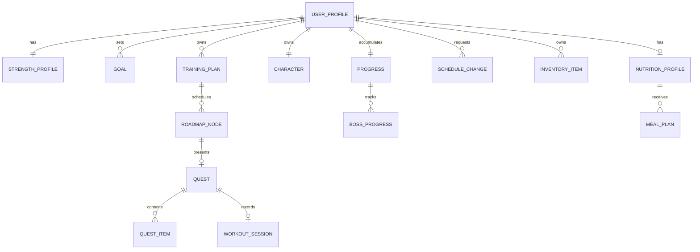

# Data Model

## Status and Scope

この文書はProduct要件を実装へ落とすための概念Data Model案、Entity責務案、関係、不変条件を整理する。正式なDatabase Schema、Entity分割、Table名、Column型、Index、RLS Policyは未決定。

- **決定済み**: ユーザーが明示したProductルールと重要な不変条件。
- **有力方針**: 要件を安全に実装するための推奨モデリング方針。正式Schemaではない。
- **候補**: 実装時に検証するEntity / Field / State案。
- **未決定**: Databaseや詳細SchemaのDecisionが必要。
- **Prototype確認**: `figma-reference/`のLocal State / Dummy Data。

以下のEntity名・関係・Fieldは、明示的に「決定済み」と記した不変条件を除き候補である。PrototypeのState名、Dummy値、Union値をProduction schemaとして固定しない。

## Modeling Principles

1. Product上の安定した概念を、画面ComponentやFigmaのState形状から分離する。
2. Exercise、Quest、Schedule、Recordは安定したIDで参照する。
3. 計画と実績を分離する。予定変更を完了実績へ変換しない。
4. AI提案、ユーザー確定、決定論的計算結果を区別する。
5. Strength、EXP、Boss等の計算結果には入力とRule Versionを残す。
6. 履歴を上書きせず、必要な変更履歴・Eventを追跡できる形にする。

## Conceptual Relationship



Diagramは概念関係であり、1 Table = 1 Entityを要求しない。

## Core Entities

### UserProfile

**概念上の責務案**: Onboardingで確定したユーザー前提とPlanning入力を保持する。

**Field候補**:

- `userId`
- `bodyWeightKg`
- `trainingExperience`
- `availableTrainingDaysPerWeek`
- `timezone`
- `foodConstraints`
- `allergies`
- `createdAt` / `updatedAt`

体重はBody Status / Planning inputであり、Boss撃破条件ではない。

### StrengthProfile

**概念上の責務案**: Main StrengthとSupport Strengthの現在状態を表す。

**Field候補**:

- `userId`
- `mainExerciseId`
- `currentEstimated1RmKg`
- `currentEstimateSourceRecordId`
- `supportExerciseIds`
- `calculationRuleVersion`

最新値だけでなく、根拠となるStrength Recordを参照できること。

### StrengthRecord（追加候補）

Product要件を正しく説明するために必要な履歴Entity候補。

- `id`
- `userId`
- `exerciseId`
- `performedAt`
- `weightKg`
- `reps`
- `sets`または代表Set情報
- `estimated1RmKg`
- `formulaVersion`
- `source`: manual / workout-session / import候補

正式なe1RM式とRecord採用規則は未決定。

### Goal

**概念上の責務案**: ユーザーが確定したFinal Strength Goalと、提示された推奨値を分離して保持する。

**Field候補**:

- `id`
- `userId`
- `exerciseId`
- `recommendedLowKg` / `recommendedHighKg`
- `confirmedTargetKg`
- `recommendationSource` / `recommendationVersion`
- `status`
- `createdAt` / `confirmedAt`

推奨値をユーザー確定値として暗黙に保存しない。

### EquipmentDefinition / Equipment Catalog

**決定済みのDomain責務**: EquipmentをExerciseから分離したMasterとして管理し、メーカーや特定Gymに依存しない安定したIDで参照する。

- `id`: `EquipmentId`
- `displayName`

MVP CatalogはBarbell、Dumbbell、Bench、Rack、Cable、主要Machine等から開始する。メーカー固有名やGym固有Machineは含めない。Database上のSchema、Catalog Versioning、更新運用は未決定。

### ExerciseDefinition / Exercise Catalog

**決定済みのDomain責務**: Exercise固有ID、表示名、Muscle、Movement Pattern、Difficulty、必要Equipment、明示的な代替関係を管理するMaster。

- `id`: `ExerciseId`
- `displayName`
- `primaryMuscles`
- `secondaryMuscles`
- `movementPattern`
- `difficulty`
- `requiredEquipmentOptions`
- `alternativeExerciseIds`

`requiredEquipmentOptions`の各要素は、そのExerciseを実施できる完全なEquipment Setを表す。いずれか1 SetをGym Equipment Profileが満たせば利用可能と判定する。器具不要Exerciseは空のSetで表す。

AIは自由なExercise名を確定せず、このCatalogに存在する`exerciseId`から選択する。Exercise情報の正式な情報源・監修方法は未決定。

### GymEquipmentProfile

**決定済みのDomain責務**: GymまたはTraining環境で利用可能な器具をEquipment CatalogのIDで表す。固定UserやPersistenceは含めない。

- `id`
- `displayName`
- `availableEquipmentIds`: `EquipmentId[]`

Exercise候補のEquipment判定では、Exerciseの必要Equipment SetをこのProfileが満たすことを必須とする。

### TrainingPlan

**概念上の責務案**: 期間、頻度、Main Goalに基づくPlanning結果を保持する。

**Field候補**:

- `id`
- `userId`
- `goalId`
- `status`: draft / proposed / active / superseded
- `startsOn`
- `trainingDaysPerWeek`
- `plannerSource`: deterministic / ai-assisted / coach候補
- `proposalPayloadVersion`
- `createdAt` / `activatedAt`

AI生成結果は`proposed`として検証し、確定後に`active`へする。

### Roadmap

**概念上の責務案**: 現在StrengthからStage BossまでのAdventure Mapを表す。

**Field候補**:

- `id`
- `userId`
- `trainingPlanId`
- `stageNumber`
- `stageTargetE1rmKg`
- `status`
- `startsOn` / `endsOnCandidate`
- `generationRuleVersion`

### RoadmapNode / ScheduledActivity（追加候補）

**概念上の責務案**: 日付付きTraining / Recovery / Boss等のNodeと状態を表す。

- `id`
- `roadmapId`
- `scheduledDate`
- `type`: training / recovery / boss / その他候補
- `status`: planned / rescheduled / available / completed / skipped候補
- `questId`
- `position`
- `movedFromNodeId` / `supersededByNodeId`候補

日付、表示順、Game progressを一つの可変indexだけで兼用しない。

### WorkoutSession

**概念上の責務案**: 現実に実行したTraining Sessionを記録する。

**Field候補**:

- `id`
- `userId`
- `questId`
- `startedAt` / `completedAt`
- `status`
- `exercisePerformances[]`
- `notes`

Exercise Performance候補：元Exercise ID、実施Exercise ID、weight、reps、sets、完了、substitution理由。

### Quest

**概念上の責務案**: 当日の攻略条件と結果を表す。

**Field候補**:

- `id`
- `userId`
- `roadmapNodeId`
- `type`: training / recovery / beginner / nutrition候補
- `status`: planned / available / in_progress / completed / expired / rescheduled候補
- `availableOn`
- `completedAt`
- `ruleVersion`
- `completionResultId`

### QuestItem（追加候補）

- `id`
- `questId`
- `kind`: main-exercise / recovery-main / bonus
- `required`
- `exerciseId`または`objectiveType`
- `target`
- `status`
- `completedAt`
- `source`: plan / ai-proposal / manual-adjustment候補

**不変条件**:

- Training Questは全Required Main Exercise完了前にCompletedにならない。
- Bonus Item未完了だけを理由にMain Training Questを未完了にしない。
- Exercise substitutionは対象Itemだけを変更し、他Itemを変更しない。

### QuestCompletionResult（追加候補）

**責務候補**: 一度だけ確定したQuest Clear結果を保持する。

- `id`
- `questId`（unique候補）
- `trainingExp`
- `nutritionExp`
- `recoveryExp`
- `mapAdvanceResult`
- `hpChange`
- `levelBefore` / `levelAfter`
- `rewardIds`
- `ruleVersion`
- `createdAt`

同一Questからの二重EXP・二重Map進行を禁止する。

### Progress

**概念上の責務案**: Stage、Map、継続、達成の現在値または集計を表す。

**Field候補**:

- `userId`
- `currentStageNumber`
- `currentRoadmapId`
- `currentNodeId`
- `questStreak`
- `lastQuestCompletedOn`
- `personalRecords`

TrendはStrengthRecord等から集計し、固定配列を保存の正としない。

### Character

**概念上の責務案**: 現実の身体とは別のゲーム内成長状態を表す。

**Field候補**:

- `userId`
- `level`
- `totalExp`
- `trainingExp`
- `nutritionExp`
- `recoveryExp`
- `expIntoLevel`
- `hpCurrent` / `hpMax`
- `appearanceStage`
- `playStyleId`
- `titleIds`

EXP値、Level curve、HP、Appearance遷移は未決定。手動Appearance Toggleは保存しない。

### BossProgress

**概念上の責務案**: Boss条件とStage攻略状態を表す。

**Field候補**:

- `id`
- `userId`
- `roadmapId`
- `stageNumber`
- `bossDefinitionId`
- `requiredE1rmKg`
- `mapReachedAt`
- `gameConditionsMetAt`
- `strengthRecordId`
- `strengthMetAt`
- `defeatedAt`
- `ruleVersion`

**不変条件**: Map到達、ゲーム条件、Strength条件の全てを満たす前にDefeatedへしない。

### Reward / Inventory

**Product上の有力方針**: Quest / Boss / Stage等の達成へ無料のゲーム内Rewardを付与できる。Reward種別と付与ルールは未決定。

**Field候補**:

- Reward: `id`, `sourceType`, `sourceId`, `rewardDefinitionId`, `grantedAt`, `ruleVersion`
- Inventory Item: `id`, `userId`, `rewardDefinitionId`, `acquiredAt`, `state`
- Reward Definition: `id`, `kind`, `name`, `rarity`, `effectDefinition`候補

Treasure効果、Random性、重複、装備、Titleへの反映は未決定。

### ScheduleChange

**概念上の責務案**: Schedule変更をQuest完了と分離して記録する。

**Field候補**:

- `id`
- `userId`
- `trainingPlanId`
- `fromNodeId`
- `requestedTargetDate`
- `proposalId`
- `resultingPlanVersion`
- `reason`
- `status`: proposed / confirmed / rejected
- `createdAt` / `confirmedAt`

**不変条件**: ScheduleChangeの確定だけではEXP、Map Position、QuestCompletionResultを生成しない。

### NutritionProfile

**概念上の責務案**: 食事提案の制約・除外条件を保持する。

**Field候補**:

- `userId`
- `allergies`
- `dietaryRestrictions`
- `foodFreedomLevel`候補
- `proteinTarget`候補
- `calorieTrackingPreference`候補

医療情報に相当し得る入力の扱い、必須項目、保持期間は未決定。

### MealPlan

**候補の責務**: Nutrition QuestまたはMeal提案を保持する。

- `id`
- `userId`
- `nutritionProfileVersion`
- `status`: proposed / accepted / completed候補
- `items`
- `aiProviderMetadata`
- `validationResult`
- `createdAt`

MealAIのData Modelをそのままコピーしない。

## State Transitions

### Quest

```text
planned → available → in_progress → completed
              └───────────────→ rescheduled / expired（詳細未決定）
```

Completedは決定論的GuardとIdempotentなCompleteQuest Use Caseだけが設定する。

### Schedule change

```text
requested → proposed → confirmed
                      └→ rejected
```

confirmedはSchedule更新だけを意味し、Quest completedを意味しない。

### Boss

```text
locked
  → map_reached
  → game_conditions_met
  → strength_met
  → challenge_available
  → defeated
  → stage_cleared
```

実装では条件が異なる順序で達成され得るため、単純な一方向Statusにするか個別Condition timestampにするか未決定。

## Prototype Data Mapping

`figma-reference/src/game/state.tsx`と`data.ts`で確認した値は次のとおり。すべてPrototype専用で、Production Defaultではない。

| 領域 | Prototype値・形状 | Productionでの扱い |
|---|---|---|
| Profile | Training 3日、e1RM 70kg、Goal 85kg | Onboardingで保存。Default値未決定 |
| Character | Lv.7、EXP 640/320/180、次Level 1000 | EXP / Level curve未決定 |
| HP | 35 / 100、Recoveryで+55、Character Buttonで100 | HPルール未決定 |
| Weight | 67.2kg、Target 68〜70kg | Onboarding値との連携が必要 |
| Main Exercises | Bench / Incline DB / Cable Rowの固定3件 | Training Planから生成 |
| Bonus | Protein 140g、2400kcal、PR等 | PersonalizationとMVP範囲未決定 |
| Support Stats | 固定4件、Leg Press lagging | Record Trendから評価 |
| Progress | e1RM / Weight各8件、Boss履歴、7日Streak | 保存Recordから集計 |
| Treasure | 6件Pool、Client-side random | Rule・効果・抽選未決定 |
| Boss | Iron Colossus、Power 80、Current 76kg | Stage / Recordから生成 |

## Validation Rules

実装時に最低限必要なValidation候補：

- Equipment / Exercise Catalog内のIDが重複せず、全Equipment参照とAlternative Exercise参照がCatalogに存在すること。
- Exercise候補がGym Equipment Profileで満たせる完全なEquipment Setを少なくとも1つ持つこと。
- Weight、reps、sets、Training frequencyの許容範囲。
- Main Exerciseがe1RM対応か。
- AllergyとMeal提案の衝突。
- Quest ownership、日付、Status。
- Exercise completionの重複と取消可否。
- Schedule移動先が未来日で、Boss / Completed Nodeではないこと。
- Boss判定に使うStrength Recordの種目、鮮度、Formula Version。
- EXP、Reward、Stage処理のIdempotency。

正式な値域とError messageは未決定。

## Database未決定事項

- Supabase PostgreSQLの正式採用
- Supabase Authの採用とUser ID
- Table分割、JSONB使用範囲、Index
- Row Level Security
- Migration tool
- Event / Audit table
- Soft delete / retention
- Offline / sync
- Seed / fixture戦略
- Personal Data export / deletion
