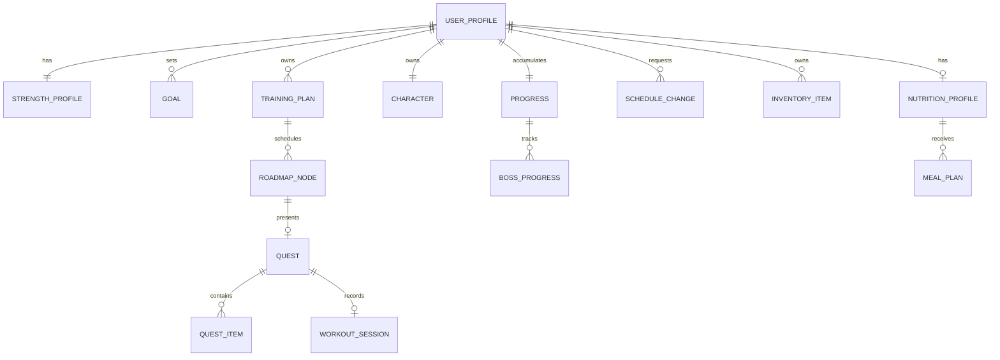

# Data Model

## Status and Scope

この文書はProduct要件を実装へ落とすための概念Data Model案、Entity責務案、関係、不変条件を整理する。正式なDatabase Schema、Entity分割、Table名、Column型、Index、RLS Policyは未決定。

- **決定済み**: ユーザーが明示したProductルールと重要な不変条件。
- **有力方針**: 要件を安全に実装するための推奨モデリング方針。正式Schemaではない。
- **候補**: 実装時に検証するEntity / Field / State案。
- **未決定**: Databaseや詳細SchemaのDecisionが必要。
- **Prototype確認**: `figma-reference/`のLocal State / Dummy Data。

以下のEntity名・関係・Fieldは、明示的に「決定済み」と記した不変条件を除き候補である。PrototypeのState名、Dummy値、Union値をProduction schemaとして固定しない。

## Modeling Principles

1. Product上の安定した概念を、画面ComponentやFigmaのState形状から分離する。
2. Exercise、Quest、Schedule、Recordは安定したIDで参照する。
3. 計画と実績を分離する。予定変更を完了実績へ変換しない。
4. AI提案、ユーザー確定、決定論的計算結果を区別する。
5. Strength、EXP、Boss等の計算結果には入力とRule Versionを残す。
6. 履歴を上書きせず、必要な変更履歴・Eventを追跡できる形にする。

## Conceptual Relationship



Diagramは概念関係であり、1 Table = 1 Entityを要求しない。

## Core Entities

### UserProfile

**概念上の責務案**: Onboardingで確定したユーザー前提とPlanning入力を保持する。

**Field候補**:

- `userId`
- `bodyWeightKg`
- `trainingExperience`
- `availableTrainingDaysPerWeek`
- `timezone`
- `foodConstraints`
- `allergies`
- `createdAt` / `updatedAt`

体重はBody Status / Planning inputであり、Boss撃破条件ではない。

### StrengthProfile

**概念上の責務案**: Main StrengthとSupport Strengthの現在状態を表す。

**Field候補**:

- `userId`
- `mainExerciseId`
- `currentEstimated1RmKg`
- `currentEstimateSourceRecordId`
- `supportExerciseIds`
- `calculationRuleVersion`

最新値だけでなく、根拠となるStrength Recordを参照できること。

### StrengthRecord（追加候補）

Product要件を正しく説明するために必要な履歴Entity候補。

- `id`
- `userId`
- `exerciseId`
- `performedAt`
- `weightKg`
- `reps`
- `sets`または代表Set情報
- `estimated1RmKg`
- `formulaVersion`
- `source`: manual / workout-session / import候補

D-023でMVPのe1RM式とRecord採用規則は決定済み。1回は実重量、2〜10回は未丸めEpley、11回以上は推定対象外。Workoutごとに同一種目の適格Setから最大値を選び、現在値は基準日時を含む直近30×24時間のWorkout代表値の最大、PBは全期間最大とする。`shared/`の`StrengthSetInput`と`WorkoutE1rmResult`は計算用型であり、このField一覧やTable分割を正式な保存Schemaにしない。`sourceSetIndex`と`ruleVersion`は計算根拠の追跡に使う。

保存時に元の重量・回数・日時・種目とRule Versionを残せるようにする。現在値が失効しても過去PBや撃破済みBossを消さない。Warmup / Working Set、RPE / RIR、Self-reported Recordの確定・修正、異Versionの再計算・移行は未決定。

### Goal

**概念上の責務案**: ユーザーが確定したFinal Strength Goalと、提示された推奨値を分離して保持する。

**Field候補**:

- `id`
- `userId`
- `exerciseId`
- `recommendedLowKg` / `recommendedHighKg`
- `confirmedTargetKg`
- `recommendationSource` / `recommendationVersion`
- `status`
- `createdAt` / `confirmedAt`

推奨値をユーザー確定値として暗黙に保存しない。

### EquipmentDefinition / Equipment Catalog

**決定済みのDomain責務**: EquipmentをExerciseから分離したMasterとして管理し、メーカーや特定Gymに依存しない安定したIDで参照する。

- `id`: `EquipmentId`
- `displayName`

MVP CatalogはBarbell、Dumbbell、Bench、Rack、Cable、主要Machine等から開始する。メーカー固有名やGym固有Machineは含めない。Database上のSchema、Catalog Versioning、更新運用は未決定。

### ExerciseDefinition / Exercise Catalog

**決定済みのDomain責務**: Exercise固有ID、表示名、Muscle、Movement Pattern、Difficulty、必要Equipment、明示的な代替関係を管理するMaster。

- `id`: `ExerciseId`
- `displayName`
- `primaryMuscles`
- `secondaryMuscles`
- `movementPattern`
- `difficulty`
- `requiredEquipmentOptions`
- `alternativeExerciseIds`

`requiredEquipmentOptions`の各要素は、そのExerciseを実施できる完全なEquipment Setを表す。いずれか1 SetをGym Equipment Profileが満たせば利用可能と判定する。器具不要Exerciseは空のSetで表す。

AIは自由なExercise名を確定せず、このCatalogに存在する`exerciseId`から選択する。Exercise情報の正式な情報源・監修方法は未決定。

### GymEquipmentProfile

**決定済みのDomain責務**: GymまたはTraining環境で利用可能な器具をEquipment CatalogのIDで表す。固定UserやPersistenceは含めない。

- `id`
- `displayName`
- `availableEquipmentIds`: `EquipmentId[]`

Exercise候補のEquipment判定では、Exerciseの必要Equipment SetをこのProfileが満たすことを必須とする。

### Training Candidate Boundary

**決定済みのDomain責務**: AI Training Plannerへ渡す前に、Exercise Catalogから許可された候補を決定論的に構築する。これはDatabase Schemaや完成したTraining Planではない。

`TrainingCandidateRequest`:

- `equipmentProfile`: 必須
- `mainExerciseId`: 任意。外部入力の検証境界とするため文字列を受け、Catalog所属とEquipment適合を検証する
- `targetMuscles`: 任意
- `targetMovementPatterns`: 任意
- `difficulty`: 任意

`TrainingCandidateResult`:

- `mainExercise`: 有効なMain Exercise指定時だけ存在し、他候補と分けて保持する
- `candidateExercises`: Main Exerciseを除く、条件とEquipmentを満たしたCatalog由来候補

各Planner向け候補は`exerciseId`、`displayName`、`primaryMuscles`、`secondaryMuscles`、`movementPattern`、`difficulty`を持つ。Persistence、Userとの関連、AI Response Schemaではない。

不明な`mainExerciseId`と、Profileで実施不可能なMain Exerciseは、それぞれ識別可能なErrorとして返す。候補数、Main Liftの配置、具体的なsets / reps推奨範囲、weightの決定は未決定で、このCandidate型へ固定しない。後段のDraft形状はD-020を参照する。

### TrainingSessionPlannerInput / Input Validation

**MVP時点の決定済みDomain境界（D-022）**: 1回のTraining Session向け入力。`TrainingCandidateResult`に、`context.trainingExperienceMonths`（0以上の有限整数）と`context.sessionFocus.targetMuscles`（必須配列）、任意の`targetMovementPatterns`を添える。Muscle / Movementは既存CatalogのTypeを再利用し、経験月数から初心者等の派生Levelを作らない。

`validateTrainingSessionPlannerInput(unknown)`は未知Field、候補のCatalog ID / Metadata・重複、経験月数、Focusの配列と既知値を検査し、`{ valid: true, value }`または`{ valid: false, errors }`を返す。Equipment ProfileをInputへ含めないため器具Filterは再実行せず、Candidate Builderが生成した結果を受ける境界とする。Focusと候補が重なる最低件数やFocus部位数の上限は未決定で、Validationに固定しない。

週頻度、Strength Record、e1RM、Final Goal、Stage target、実重量、Nutrition / Game StateはSession Planner Inputへ含めない。週頻度とTraining / Recovery配置はSchedule / Roadmap側、実重量は後続の決定論的Load / Progression側の責務。これはPersistence Schemaではなく、将来のSchedule設計に応じ変更可能なMVP Input Boundaryである。

### TrainingPlanDraft / Domain Validation

**決定済みのDomain責務**: 1回のTraining SessionのPlanner出力は自由文ではなく構造化Draftとし、`TrainingCandidateResult`に対して決定論的に再検証する。これは下記の期間・User・Statusを持つ概念`TrainingPlan`やDatabase Schemaとは別の境界である。

- `TrainingPlanDraft.exercises`: 順序付きの`PlannedExercise[]`。Array順をExercise順とし、別の`order` Fieldは持たない。
- `PlannedExercise`: `exerciseId`、`role`（`main` / `accessory`）、正の整数`sets`、`repRange`（正の整数`min` / `max`、`min <= max`）。
- `weight`は含めない。将来のValidated Planの後段にある決定論的Load / Progression Logicで扱う。

`validateTrainingPlanDraft(draft, candidates)`は未知の実行時入力を受け、空Plan、今回のCandidate外ID、Exercise重複、必須Mainの欠落・Role不一致、複数Main、Role・sets・rep range・Field形状を検査する。成功時のみ正規化されたPlanを返し、失敗時はcodeとpathを持つError一覧を返す。Catalogにあるだけでは今回の選択を許可しない。

具体的なsets / reps推奨範囲、Training Volumeの妥当性、実重量、AI Output保存形式、Questへの変換は未決定。D-020単独ではOpenAI固有SchemaやStructured Outputs機能の採用を意味せず、それらは後続のD-021で採用した。

### TrainingPlan

**概念上の責務案**: 期間、頻度、Main Goalに基づくPlanning結果を保持する。

**Field候補**:

- `id`
- `userId`
- `goalId`
- `status`: draft / proposed / active / superseded
- `startsOn`
- `trainingDaysPerWeek`
- `plannerSource`: deterministic / ai-assisted / coach候補
- `proposalPayloadVersion`
- `createdAt` / `activatedAt`

AI生成結果は`proposed`として検証し、確定後に`active`へする。

### Roadmap

**概念上の責務案**: 現在StrengthからStage BossまでのAdventure Mapを表す。

**Field候補**:

- `id`
- `userId`
- `trainingPlanId`
- `stageNumber`
- `stageTargetE1rmKg`
- `status`
- `startsOn` / `endsOnCandidate`
- `generationRuleVersion`

**D-025の計算用境界（保存Schemaではない）**: `StagePlanningInput`はoptional / nullのcurrent e1RMとFinal Goalを受け、`planNextStage()`が`StagePlanningResult`を返す。baselineがなければ`baseline_required`、currentがgoal以上なら`goal_reached`（goal超過時は`goalUpdateRequired`）、それ以外は次の`stageTargetE1rmKg`を返す。ここでFinal Goalを変更せず、Historical PBも参照しない。

`AchievementDurationEstimatorInput`は`exerciseId`、`currentE1rmKg`、`stageTargetE1rmKg`、`trainingExperienceMonths`、`trainingFrequencyPerWeek`だけを持つAI Use Case専用のInput Boundaryである。未知Field、Catalog外Exercise、非有限または不正なe1RM境界、経験月数、頻度を`validateAchievementDurationEstimatorInput()`で検証する。これは`TrainingSessionPlannerInput`、User Profile、Onboarding persistence、ScheduleやRoadmap Nodeの保存形状ではない。

AI出力は`AchievementDurationEstimate`の`estimatedAchievementDays`のみで、sharedの`validateAchievementDurationEstimate()`を通す。`RoadmapDurationSelectionResult`はestimateと選択候補または`stage_replanning_required`、Duration Selection Rule Versionを持つ計算結果であり、Boss dateやNodeを含めない。将来保存する場合にStage Planning Rule、Duration Selection Rule、AI Prompt / Schema Version、model metadataをどのEntityへ保持するかは未決定。

**D-026の計算用境界（保存Schemaではない）**: `StageRoadmapGenerationInput`は`startDate`（厳格な`YYYY-MM-DD`）、D-025の`RoadmapDurationDays`、構造上`1..7`の`trainingFrequencyPerWeek`、Catalog `mainExerciseId`、正で有限の`stageTargetE1rmKg`を持つ。`generateStageRoadmap()`は同数の`StageRoadmapDay[]`と、`startDate + durationDays`の`StageBossAnchor`を返す。Training Dayは`sessionFocus.targetMuscles`だけを持ち、値はMain ExerciseのCatalog `primaryMuscles`から得る。これはExercise plan、sets、reps、weight、movement focus、Quest / EXP / Map / Boss Stateを表さない。

**D-034のSchedule変更境界（保存Schemaではない）**: `StageRoadmap.days[index]`のidentityはindex / `dayIndex`であり、`date`は変更可能なCalendar schedule fieldである。`startDate`はStageの当初開始日としてimmutable、`durationDays`は当初の基本期間とDaily Slot数としてimmutableである。実際のBoss予定日は`roadmap.boss.date`で表す。

`rescheduleCurrentQuest(roadmap, currentDayIndex, newDate, today)`はCurrent Daily Slotの日付を未来へ延期し、Current index以降の全Daily SlotとBoss Anchorへ同じカレンダー日数を加えるpure calculationである。完了済み過去Slotは完全に保持し、Nodeを挿入・削除・sortせず、Quest Type、Session Focus、Boss Main Exposure、Stage Target、Main Exercise、`currentDayIndex` / `StageProgress`を変更しない。date-only strict `YYYY-MM-DD` validation、UTC-based calendar-day add、timezone非依存のGregorian calendar differenceを用い、DomainはClockを読まない。変更後も`planByDay[dayIndex]`と`workoutResultsByDay[dayIndex]`は同じindex / 内容に残る。

Stage Program RequestのRoadmap validationは、各Daily Slotのcanonical `startDate + index`との差であるdelay offsetを検証する。全offsetは0以上かつslot順に非減少で、Boss dateのoffsetは最後のDaily Slotのoffsetと同じでなければならない。期間、daily count/type、D-032 Focus / Exposure、Main / Target / generation version等のcanonical validationは維持する。React Session内でRoadmapのみを更新し、DB、localStorage、schedule historyは追加しない。

**D-027の計算用進行境界（保存Schemaではない）**: `StageProgress`は`{ currentDayIndex: number }`だけを持つ。`0..roadmap.days.length`の整数だけを許可し、Roadmap本体や日別Nodeに完了Stateを書き込まない。indexより前はcompleted、同じindexはavailable、後ろはlockedとして`StageProgressView`へ導出する。indexがdaily node総数と等しいときBoss Anchorはavailableだが、Boss State、Strength判定、Defeated、Stage Clear、Rewardを表さない。

`TrainingQuestCompletionEvaluation`は保存するCheckbox集合ではない。Validated Training Planの各main / accessory Exerciseについて、有効な`ExerciseWorkoutResult`が予定Snapshotと整合し、各planned Exerciseにちょうど1件存在するかを導出する。予定Set数未達とrep range外はResultを無効にしない。planned / performedが異なる場合だけEquipment Profileと既存CatalogのSubstitution候補で確認し、実績・e1RMの帰属先を変更しない。Evaluationは進行Stateを更新せず、明示的なTraining / Recovery completionだけがindexを1進める。

**D-029の計算用Onboarding境界（保存Schemaではない）**: `OnboardingRoadmapInput`は正の有限な`bodyWeightKg`、0以上の整数`trainingExperienceMonths`、1..7の整数`trainingFrequencyPerWeek`、Boss対象4種目の`mainExerciseId`、任意の自己申告`baselineWeightKg` / `baselineReps`（両方あるか両方ない）、正の有限な`finalGoalE1rmKg`、厳格な`startDate`を持つ。未知Field、Catalog外ID、Boss対象外ID（Pull-upを含む）、不正なSet、GoalがBaseline以下、日付不正を区別する。Baseline不明なら`baseline_required`でDuration / Roadmapは生成しない。

`OnboardingSelfReportedBaseline`は`source: 'onboarding_self_reported'`、Exercise ID、入力重量・reps、D-023の未丸め`baselineE1rmKg`、計算Rule Versionを持つ。これはWorkout History、rolling-window `currentE1rm`、Workout Resultの保存Recordではない。`prepareOnboardingRoadmap()`はD-025のStage TargetとEstimator Inputを作り、`completeOnboardingRoadmap()`は検証済みAI日数からD-025のDuration、D-026のRoadmap、D-027の初期Progressを作り、成功結果に検証済みOnboarding入力も保持する。known Flowの42日超は`stage_replanning_required`でRoadmapを返さず、D-041 unknown Flowだけは後述の42日fallbackを使う。Training Plan / Equipment / Food制約はこの境界には含めない。Profile永続Schema、自己申告の修正・信頼性Policyは引き続き未決定である。

### RoadmapNode / ScheduledActivity（追加候補）

**概念上の責務案**: 日付付きTraining / Recovery / Boss等のNodeと状態を表す。

- `id`
- `roadmapId`
- `scheduledDate`
- `type`: training / recovery / boss / その他候補
- `status`: planned / rescheduled / available / completed / skipped候補
- `questId`
- `position`
- `movedFromNodeId` / `supersededByNodeId`候補

日付、表示順、Game progressを一つの可変indexだけで兼用しない。

### WorkoutSession

**概念上の責務案**: 現実に実行したTraining Sessionを記録する。

**Field候補**:

- `id`
- `userId`
- `questId`
- `startedAt` / `completedAt`
- `status`
- `exercisePerformances[]`
- `notes`

Exercise Performance候補：元Exercise ID、実施Exercise ID、weight、reps、sets、完了、substitution理由。

**MVP時点の決定済みDomain境界（D-024 / D-036 / D-041）**: `ExerciseWorkoutResult`は1 Exerciseの実績を表し、`plannedExerciseId`、`performedExerciseId`、`role`、予定時点の`plannedSets` / `plannedRepRange`、順序を示す`setNumber`ごとの`CompletedSetRecord[]`、任意のExercise単位`difficultyFeedback`、`performedAt`を持つ。`difficultyFeedback`は`too_hard` / `just_right` / `easy`のいずれかであり、Set単位ではない。Weighted Exerciseの各Setは正の有限`weightKg`と正の整数`reps`を持つ。`BODYWEIGHT_EXERCISE_IDS`は例外としてrepsだけを持ち、重量Fieldを拒否する。Exercise全体へ一つの重量は固定しない。これは正式なTable / 保存Schemaではない。

`validateExerciseWorkoutResult(unknown)`はCatalogに存在する予定・実施Exercise ID、role、予定Set数 / rep range、少なくとも1件の完了Set、Set番号の正値・重複なし、Exercise IDに応じた重量有無、正の整数rep、任意のExercise単位`difficultyFeedback`、timestamp、未知Fieldを検査する。Weighted種目には各Setの正の有限重量を必須とし、Bodyweight3種には重量を許さない。Feedbackの許可値は`too_hard`、`just_right`、`easy`であり、未指定なら有効、未知値は拒否する。FeedbackはResultと一緒に保存・編集される。予定より少ないSet、rep range外、plannedExerciseIdとperformedExerciseIdの相違は有効な記録として受け入れる。空の途中入力はWorkout Resultではなく、将来のUI / Draft責務としてこのDomainへ含めない。

`validateWorkoutResultAgainstPlan()`は保存済みPlan Snapshotとの予定Exercise、role、予定Set数、rep rangeだけを照合し、実重量・実repを判定しない。`calculateWorkoutResultE1rm()`は`performedExerciseId`とWeighted種目の完了Setを既存D-023の`calculateWorkoutE1rm()`へ渡し、Bodyweightではe1RMを返さない。代替Exerciseの実績を元Exerciseへ自動移管しない。D-027はこの既存検証をTraining Quest Clearの前提に利用する。Task 4FのFeedbackはResult単位で保存され、Task 4Gの`exercise-progression-v1`では`too_hard`のみが進行Veto、未選択は中立となる。SuggestionとProgressionは成功Training Clearまで更新しない。

### ExerciseProgressState（D-035 4E Session内）

```ts
type ExerciseBaselineSource = 'onboarding' | 'self_report' | 'workout_result';

type ExerciseBaseline = {
  weightKg: number;
  reps: number;
  estimatedE1rmKg?: number;
  e1rmRuleVersion?: typeof E1RM_RULE.version;
  source: ExerciseBaselineSource;
  capturedDayIndex: number;
};

type ExerciseSuggestionStatus = 'active' | 'weight_up_ready';
type ExerciseSuggestion = {
  weightKg?: number;
  targetReps: number;
  repRange: RepRange;
  status: ExerciseSuggestionStatus;
  ruleVersion: 'exercise-progression-v1';
};
type ExerciseProgressState = {
  exerciseId: ExerciseId;
  baseline?: ExerciseBaseline;
  sessionsCompleted: number;
  nextSuggestion?: ExerciseSuggestion;
  loadStepKg?: number;
};
```

`AdventureQuestDomainState.exerciseProgressById`はExercise ID keyedのin-memory map。Main StrengthだけはOnboardingの実測重量 / repsを`source: 'onboarding'`、初期day index、`sessionsCompleted: 0`で持つ。その他のExerciseは任意の`source: 'self_report'`、またはそのExerciseの初回有効Workout Resultから`source: 'workout_result'`でBaselineを得る。自己申告repsは正の整数で、重量は正の有限値。D-023でe1RM計算可能なら未丸め値とRule Versionを保持し、適格外でもBaselineは残す。

Workout Result由来Baselineは`performedExerciseId`へ帰属する。D-023適格Weighted Setがある場合はWorkout内最大e1RMを選び、その根拠Setの重量 / repsを保存する。全Setがe1RM対象外なら、最小setNumberの有効Weighted SetをBaselineにしてe1RMを省略する。Baselineは一度設定した後、通常Resultで上書きしない。`BODYWEIGHT_EXERCISE_IDS`はkg自己申告・Workout Result由来kg Baselineの対象外であり、架空の重量を作らない。

`sessionsCompleted`は、成功したTraining Quest Clearに限り、実際に行った各unique Exerciseにつき一度だけ加算する。Result保存、Baseline登録、同一Questでの複数Result、Recovery Clear、失敗・二重Clearでは加算しない。

`nextSuggestion`は`exercise-progression-v1`のsession内hintで、`targetReps`はcurrent Plan rangeへclampする。初期値はrange.min、Baseline repsがrange内ならそのBaseline重量を使い、それ以外は重量未設定とする。Result入力へprefillしない。successful Training Clearで全planned Set、target reps、必要ならsuggested weightを検査し、最大rep達成時はユーザー設定`loadStepKg`で一段だけ進める。刻み未設定なら`weight_up_ready`と現在重量を保持する。`too_hard`、Partial、目標未達、suggestion未満重量ではSuggestion維持。Baselineは不変であり、前回Feedback / Performanceのduplicate stateを持たない。Bodyweightには重量Suggestionやload stepを持たせず、全planned Setでrepsのみを段階化しmaxで維持する。Result保存・編集ではProgressionを更新せず、successful Clearの既存Progress / Growth / Reward / Session count transitionと同時に確定する。Exercise Progressは現在のAdventure Session内だけにあり、Refresh後の保持や永続化はしない。

### Quest（保存候補。D-027 MVPのidentityではない）

**概念上の責務案**: 当日の攻略条件と結果を表す。

**Field候補**:

- `id`
- `userId`
- `roadmapNodeId`
- `type`: training / recovery / beginner / nutrition候補
- `status`: planned / available / in_progress / completed / expired / rescheduled候補
- `availableOn`
- `completedAt`
- `ruleVersion`
- `completionResultId`

### QuestItem（追加候補）

- `id`
- `questId`
- `kind`: main-exercise / recovery-main / bonus
- `required`
- `exerciseId`または`objectiveType`
- `target`
- `status`
- `completedAt`
- `source`: plan / ai-proposal / manual-adjustment候補

**不変条件**:

- Training Questは全Required Main Exercise完了前にCompletedにならない。
- Bonus Item未完了だけを理由にMain Training Questを未完了にしない。
- Exercise substitutionは対象Itemだけを変更し、他Itemを変更しない。

### QuestCompletionResult（追加候補）

**責務候補**: 一度だけ確定したQuest Clear結果を保持する。

- `id`
- `questId`（unique候補）
- `trainingExp`
- `nutritionExp`
- `recoveryExp`
- `mapAdvanceResult`
- `hpChange`
- `levelBefore` / `levelAfter`
- `rewardIds`
- `ruleVersion`
- `createdAt`

同一Questからの二重EXP・二重Map進行を禁止する。

### Progress

**概念上の責務案**: Stage、Map、継続、達成の現在値または集計を表す。

**Field候補**:

- `userId`
- `currentStageNumber`
- `currentRoadmapId`
- `currentNodeId`
- `questStreak`
- `lastQuestCompletedOn`
- `personalRecords`

TrendはStrengthRecord等から集計し、固定配列を保存の正としない。

### Character

**概念上の責務案**: 現実の身体とは別のゲーム内成長状態を表す。

**D-035 MVPで決定済みのSession内State**: `CharacterGrowth`は5つの`trainingExp` category（chest / back / shoulders / arms / legs）と`recoveryExp`を持つ累積EXPだけを表し、初期値は全て0。Level、HP、Nutrition EXP、AppearanceはこのStateに含めない。ExerciseからPrimary Training EXP categoryへの対応は`exercise-exp-category-v1`、Quest rewardは`quest-reward-v1`で管理する。これはDatabase schemaや永続化Decisionではない。

**D-038 Character Screen v1**: 画面はこの既存`CharacterGrowth`を再集計せず表示する。Main StrengthのStart Baseline、Onboarding-confirmed Final Goal、Clear済みWorkout Resultは既存Adventure Session dataを参照する。Roadmapの日別Quest数と`StageProgress.currentDayIndex`から進行表示を導出する。これらは新しいPersistence schemaではなく、Session内Presentation境界である。

**Field候補**:

- `userId`
- `level`
- `totalExp`
- `trainingExp`: chest / back / shoulders / arms / legs別の累積整数EXP
- `nutritionExp`
- `recoveryExp`
- `expIntoLevel`
- `hpCurrent` / `hpMax`
- `appearanceStage`
- `playStyleId`
- `titleIds`

Level curve、HP、Appearance遷移と将来のEXP配分変更は未決定。手動Appearance Toggleは保存しない。

### QuestRewardSummary（D-035 Session内結果）

Quest Clear時の実適用RewardをPresentationへ渡す一時的なsnapshot。

- `dayIndex`
- `questType`: training / recovery
- `trainingExpGained`: 今回増加したTraining categoryのみ
- `recoveryExpGained`
- `mapProgressGained`: 1

Workout ResultやCalendar dateをQuest identityとして使わない。Progress、CharacterGrowth、Reward Summaryを同じClear transitionで更新し、Overlay表示・再表示では再付与しない。保存形式、取消・訂正履歴、永続化は未決定。

### BossProgress

**概念上の責務案**: Boss条件とStage攻略状態を表す。

**Field候補**:

- `id`
- `userId`
- `roadmapId`
- `stageNumber`
- `bossDefinitionId`
- `requiredE1rmKg`
- `mapReachedAt`
- `gameConditionsMetAt`
- `strengthRecordId`
- `strengthMetAt`
- `defeatedAt`
- `ruleVersion`

**不変条件**: Map到達、ゲーム条件、Strength条件の全てを満たす前にDefeatedへしない。

### Reward / Inventory

### D-040 in-memory Boss / Stage transition

Production v1 keeps Boss separate from `StageProgress` and Daily Quest results. The session `BossBattleState` contains `ruleVersion`, `originalStageTargetE1rmKg`, frozen `targetE1rmKg`, `adapted`, `defeated`, and optional `winningAttempt { exerciseId, weightKg, reps, estimatedE1rmKg }`. Only an actual Main set from a cleared Training Quest contributes to target adaptation; Boss attempts are not Workout Results.

The active Adventure state also carries `stageNumber` and optional `CompletedStageSummary` entries. Each summary preserves the Stage number, original/Boss targets, winning attempt, adaptation flag, completed Roadmap/progress and actual results by day. Starting the next Stage resets current progress, Boss state, plan cache, result and skip maps; equipment, profile/context, Character Growth and `ExerciseProgressState` remain. All are in-memory Session state; there is no database schema or persistence contract.

**Product上の有力方針**: Quest / Boss / Stage等の達成へ無料のゲーム内Rewardを付与できる。Reward種別と付与ルールは未決定。

**Field候補**:

- Reward: `id`, `sourceType`, `sourceId`, `rewardDefinitionId`, `grantedAt`, `ruleVersion`
- Inventory Item: `id`, `userId`, `rewardDefinitionId`, `acquiredAt`, `state`
- Reward Definition: `id`, `kind`, `name`, `rarity`, `effectDefinition`候補

Treasure効果、Random性、重複、装備、Titleへの反映は未決定。

### ScheduleChange

**概念上の責務案**: Schedule変更をQuest完了と分離して記録する。

**Field候補**:

- `id`
- `userId`
- `trainingPlanId`
- `fromNodeId`
- `requestedTargetDate`
- `proposalId`
- `resultingPlanVersion`
- `reason`
- `status`: proposed / confirmed / rejected
- `createdAt` / `confirmedAt`

**不変条件**: ScheduleChangeの確定だけではEXP、Map Position、QuestCompletionResultを生成しない。

### NutritionProfile

**概念上の責務案**: 食事提案の制約・除外条件を保持する。

**Field候補**:

- `userId`
- `allergies`
- `dietaryRestrictions`
- `foodFreedomLevel`候補
- `proteinTarget`候補
- `calorieTrackingPreference`候補

医療情報に相当し得る入力の扱い、必須項目、保持期間は未決定。

### MealPlan

**候補の責務**: Nutrition QuestまたはMeal提案を保持する。

- `id`
- `userId`
- `nutritionProfileVersion`
- `status`: proposed / accepted / completed候補
- `items`
- `aiProviderMetadata`
- `validationResult`
- `createdAt`

MealAIのData Modelをそのままコピーしない。

## State Transitions

### Quest

```text
planned → available → in_progress → completed
              └───────────────→ rescheduled / expired（詳細未決定）
```

Completedは決定論的GuardとIdempotentなCompleteQuest Use Caseだけが設定する。

### Schedule change

```text
requested → proposed → confirmed
                      └→ rejected
```

confirmedはSchedule更新だけを意味し、Quest completedを意味しない。

### Boss

```text
locked
  → map_reached
  → game_conditions_met
  → strength_met
  → challenge_available
  → defeated
  → stage_cleared
```

実装では条件が異なる順序で達成され得るため、単純な一方向Statusにするか個別Condition timestampにするか未決定。

## Prototype Data Mapping

`figma-reference/src/game/state.tsx`と`data.ts`で確認した値は次のとおり。すべてPrototype専用で、Production Defaultではない。

| 領域 | Prototype値・形状 | Productionでの扱い |
|---|---|---|
| Profile | Training 3日、e1RM 70kg、Goal 85kg | Onboardingで保存。Default値未決定 |
| Character | Lv.7、EXP 640/320/180、次Level 1000 | EXP / Level curve未決定 |
| HP | 35 / 100、Recoveryで+55、Character Buttonで100 | HPルール未決定 |
| Weight | 67.2kg、Target 68〜70kg | Onboarding値との連携が必要 |
| Main Exercises | Bench / Incline DB / Cable Rowの固定3件 | Training Planから生成 |
| Bonus | Protein 140g、2400kcal、PR等 | PersonalizationとMVP範囲未決定 |
| Support Stats | 固定4件、Leg Press lagging | Record Trendから評価 |
| Progress | e1RM / Weight各8件、Boss履歴、7日Streak | 保存Recordから集計 |
| Treasure | 6件Pool、Client-side random | Rule・効果・抽選未決定 |
| Boss | Iron Colossus、Power 80、Current 76kg | Stage / Recordから生成 |

## Validation Rules

実装時に最低限必要なValidation候補：

- Equipment / Exercise Catalog内のIDが重複せず、全Equipment参照とAlternative Exercise参照がCatalogに存在すること。
- Exercise候補がGym Equipment Profileで満たせる完全なEquipment Setを少なくとも1つ持つこと。
- Training CandidateのMain ExerciseがCatalogに存在し、Gym Equipment Profileで実施可能であること。
- Plannerへ渡す全Candidate IDがCatalogに存在し、Gym Equipment Profileで実施可能であること。
- Training Plan Draft内の全Exercise IDが、そのRequestの`TrainingCandidateResult`で許可されていること。
- Weight、reps、sets、Training frequencyの許容範囲。
- Main Exerciseがe1RM対応か。
- AllergyとMeal提案の衝突。
- Quest ownership、日付、Status。
- Exercise completionの重複と取消可否。
- Schedule移動先が未来日で、Boss / Completed Nodeではないこと。
- Boss判定に使うStrength Recordの種目、鮮度、Formula Version。
- EXP、Reward、Stage処理のIdempotency。

e1RM対象Setの値域とrolling WindowはD-023で決定済み。その他の値域とError message、永続Schemaは未決定。

## Database未決定事項

- Supabase PostgreSQLの正式採用
- Supabase Authの採用とUser ID
- Table分割、JSONB使用範囲、Index
- Row Level Security
- Migration tool
- Event / Audit table
- Soft delete / retention
- Offline / sync
- Seed / fixture戦略
- Personal Data export / deletion

## D-041 Resilience additions

- Onboardingの`strengthKnowledge: 'unknown'`は手動Baseline / Final Goalを受け取らず、Shared Domainが`main-strength-estimate-v1`の暫定値を生成する。確定済みのknown入力shapeは維持する。
- `ExerciseBaseline.source`へ`estimated_profile`を追加し、`estimateRuleVersion`を保持する。これは実測ではなく、最初の有効なMain Strength Training Quest Clearで`workout_result`へ一度だけ置換される。
- `BODYWEIGHT_EXERCISE_IDS`はreps-only Result / Progressionを表し、`NO_EQUIPMENT_EXERCISE_IDS`はEquipmentなしで候補にできる部分集合を表す。Pull-upは前者のみ。
- Exercise Catalogは40件。D-041追加6種目はNo Equipmentかつreps-onlyで、EXP Categoryと日本語Presentation mappingを持つ。
- Equipment Profileの保存shapeは変更しない。UI preflight用に基本8件、追加8件、基本最低2件、Main requirement充足を導出するが、bodyweightという架空Equipment IDは追加しない。

## D-041 Initial Exercise Suggestion / Skip

- Main Strength初回hintはOnboarding / `estimated_profile` Baselineとplanned `repRange`からD-023 e1RMを換算したPresentation値であり、`ExerciseInitialSuggestion`のAccessory向け体重比ruleとは別経路。Final Goal / Stage Targetは入力しない。Result saveや表示によるstate mutationはなく、実Actual inputも空欄のまま。
- `ExerciseInitialSuggestion`はShared Domainの計算結果であり、Exercise Baseline、Workout Result、Exercise Progress State、永続Recordではない。Rule Version、Exercise ID、予定`repRange`、`targetReps`、weightedの場合のみ`weightKg`を持ち得る。表示用hintとしてのみ使用し、Actual inputsは空欄を保つ。
- Recommendation入力はOnboarding session contextの`bodyWeightKg` / `trainingExperienceMonths`、Catalog Exercise ID、Planned `repRange`。Bodyweight Exerciseはweight fieldなし。Dumbbell weightは片手1個あたり。Machine / Cable weight settingは機種間比較可能な絶対値を保証しない。
- `ExerciseSkipRecord`はWorkout Resultとは別のSession stateで、最低`exerciseId`（planned exercise ID）、`reason`、`pledgeAccepted: true`を持つ。Reason IDは`equipment_unavailable`、`time_constraint`、`condition`、`other`。day indexごとに保持し、成功ClearまではUndo・実施Resultとの切替が可能。
- SkipはActual Result、Baseline、Exercise sessions、Difficulty Feedback、Progression、EXP、Latest Actualを作らない。Completionは全Plan itemsがResultまたはvalid Skipで満たされ、1つ以上の有効Workout Resultがあることを要求する。これはDatabase Schema案ではなく現行Adventure Sessionのin-memory state modelである。
